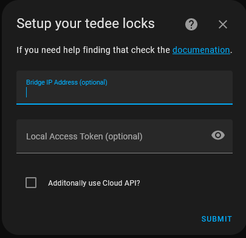
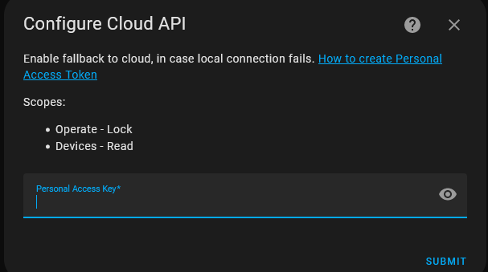

# 🤖🔒 tedee Custom Component

Integrate your [tedee smart lock](https://tedee.com/product-info/lock/) into [Home Assistant](https://www.home-assistant.io/).

  
  

This component gives basic access to your tedee smart lock. Right now it supports to lock and unlock your tedee and pull the spring. Also it gets some additional data as attributes (battery level, charging, connected, infos about pullspring).

To use the integration you need the [tedee bridge](https://tedee.com/product-info/bridge/) connected to your lock.

## Installation

This custom component can be installed using [HACS](https://hacs.xyz/).

*Important:* If you are a former user of [joerg65/tedee_lock](https://github.com/joerg65/tedee_lock), please uninstall it by deleting `/config/custom_components/tedee_lock` and remove the configuration from your `configuration.yaml`. You can reuse the personal access key, so you might keep it.

## Setup

This integration can work locally as well as with the tedee cloud. The local mode is the default way to use this integration. You can optionally set your personal access key to use the cloud mode also. If you set both, the integration will use the local mode with cloud fallback. If you leave the local settings empty and only set the personal access key, the integration will use the cloud mode.

### Config flow
In the first step of the config flow you can only configure the local API settings. You can opt-out of setting IP address and the local access token, if you want to *only* use the cloud API:  

If you check the `Additionally use Cloud API` checkbox in the first step of the config flow you will also get this window, where you can set the personal access key for the cloud API:  

### Operation modes
| Properties set | Mode |
| --- | --- |
| `Bridge IP Address` and `Local Access Token` | local only |
| `Personal Access Key` | cloud |
| `Bridge IP Address` and `Local Access Token` and `Personal Access Key` | local with cloud fallback |

### Get local access token (local)
To get your Bridge IP Address and Local Access Token you have to get the Token from the tedee App. Head to your Bridge's settings -> Local API. Make sure `Encrypted token is enabled`, click the eye icon and copy the token. Below the token you can find the IP Address of your Bridge.

### Create personal access key (cloud)

See the tedee api docs to learn how to [create a personal access key](https://tedee-tedee-api-doc.readthedocs-hosted.com/en/latest/howtos/authenticate.html#personal-access-key).

You will need these scopes:

   - Devices - Read
   - Operate - Lock

### Installation

Go to the integrations page (Configuration - Devices & Services). Click the "+ Add Integration" button in the lower left corner and look for the "tedee" integration. Insert your personal access key and click submit.

After this you should see the tedee integration on your Devices & Services page. This component creates a device for every lock with a lock entity (`lock.name_of_your_lock`).

## Configuration

You can change the following settings after setting up the integration, by going to the integration's settings and pressing the "CONFIGURE" button:

| Property | Description |
| --- | --- |
`Personal Access Key` | You can update your personal access key should it expire soon
`Bridge IP Address` | You can update your bridge IP address should it change
`Local Access Token` | You can update your local access token should it change
`Unlock pulls latch` | If checked, a "normal" unlock of your lock will also pull the latch. This is like in the tedee App when you have the "auto-pull" enabled. (Default: Disabled)

## Roadmap

This project is open for your pull requests - just implement any feature you might need! 🚀

## Known issues

- If you add a lock after setup you have to restart Home Assistant to see the new device